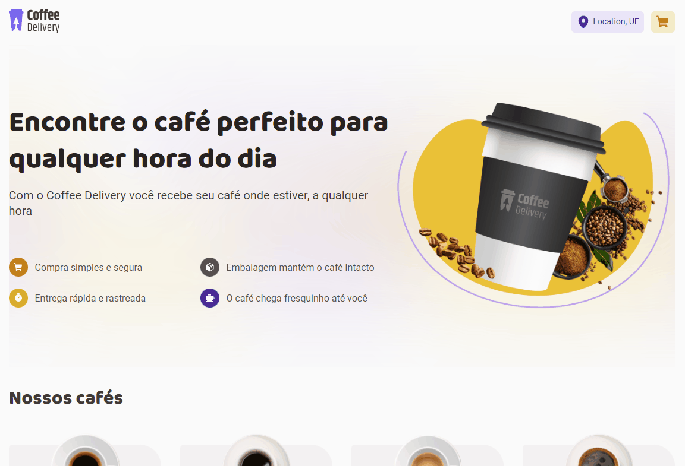
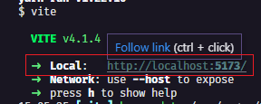

# Coffee Delivery☕
Projeto realizado no terceiro desafio da trilha React do curso Ignite na Rocketseat🚀
Onde foram aplicados conceitos do React como componentes, uso de contexto, hooks, FormProvider;

[]

## Tecnologias usadas
  - React.js
  - Typescript
  - Styled Components
  - React Hook Form
  - Zod
  - Immer
  - Vite

## Como utilizar
- Clone o projeto do repositório
```
git clone https://github.com/RafaelMatos/coffeeDelivery.git
```
- Acesse a pasta do projeto
```
cd coffeeDelivery
```
- Instale as dependências 
```
yarn
```
- Execute o projeto
```
yarn dev
```
- Acesse no navegador o endereço indicado no terminal
[]
